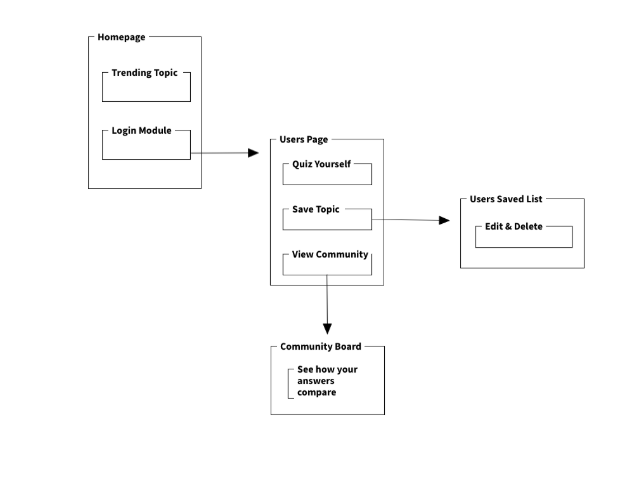

# DeFalsify
My final project for the General Assembly Software Engineering Immersive Bootcamp Course

Site is live at herokuapp.com: https://defalsify.herokuapp.com/

## User Stories
 * User will be able to view trending discussion topics/fact claims and their truth score
 * User will be able to save the topics they find most interesting to a list
 * User will be able to update and delete from this list
 * Stretch - User will be able to take a quiz guessing the validity of trending claims

[ Trello Project Management Board](https://trello.com/b/GBk2DdmF/defalsify)

## Technologies Used
App was created using AngularJS, Express, Node.js, MongoDB and Bootstrap

## To Meet MVP
* The project files will be hosted on Github
* It will be deployed online using Heroku
* I will be integrating a third party API (Google Fact Check)

